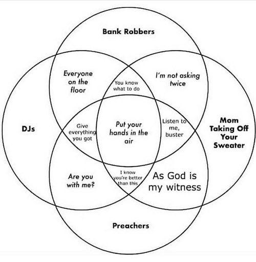

# Ch. 2 Probability {-}

Sections covered: 2.1, 2.2, 2.3, 2.5  

(2.4 will be covered later in the semester)

## 2.1 Sample Spaces and Events {-}

### Humor {-}



Source: https://twitter.com/bcrypt/status/1074415553266122752/photo/1

## 2.2 Axioms, Interpretations, and Properties of Probability {-}

## 2.3 Counting Techniques {-}

### R {-}

**Factorial**

```{r}
factorial(5)
```

**Combinations**

"5 choose 2" = choose 2 items out of 5

```{r}
choose(5, 2)
```

**Permutations**

There is no built-in function to calculate permutations.  You can multiply the number of combinations by *k!*.

Ex. Number of permutations of size 2 that can be formed from 5 distinct items:

```{r}
choose(5,2)*factorial(2)
```

You can create your own function to do this:
```{r}
perm <- function(n, k) {choose(n,k)*factorial(k)}

perm(5,2)
```

## 2.5 Independence {-}

Skip everything before "The Multiplication Rule" on p. 86 (until we return to conditional probability later in the semester)
