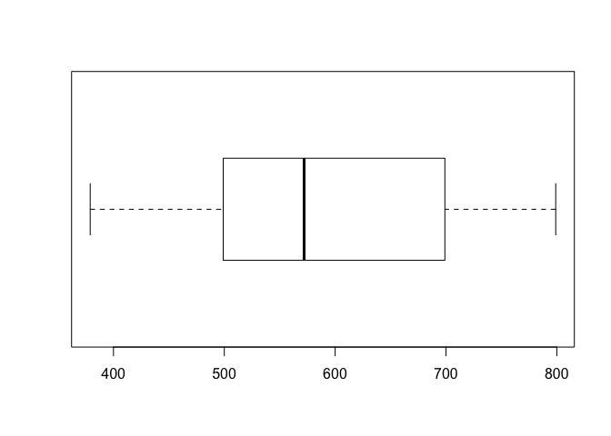
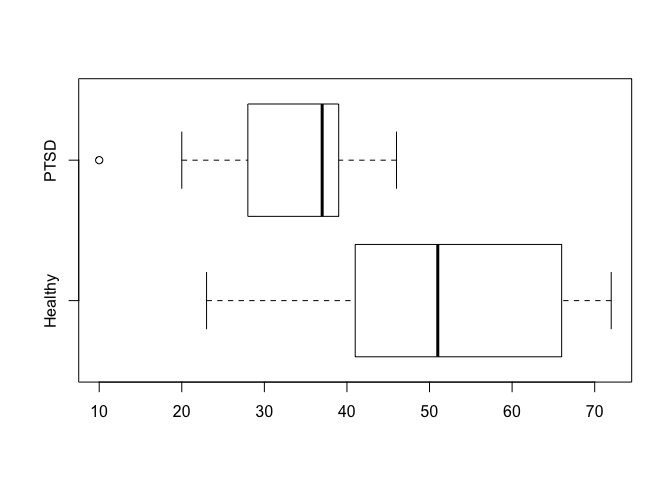

``` r
# box plots

prices <- c(379, 425, 450, 450, 499, 529, 535, 535, 545,
            599, 665, 675, 699, 699, 725, 725, 745, 799)

boxplot(prices)
```


``` r
boxplot(prices, horizontal = TRUE)
```



``` r
PTSD <- c(10, 20, 25, 28, 31, 35, 37, 38, 38, 39, 39, 42, 46)

Healthy <- c(23, 39, 40, 41, 43, 47, 51, 58, 63, 66, 67, 69, 72)

df <- data.frame(Healthy, PTSD)

boxplot(df, horizontal = TRUE)
```


