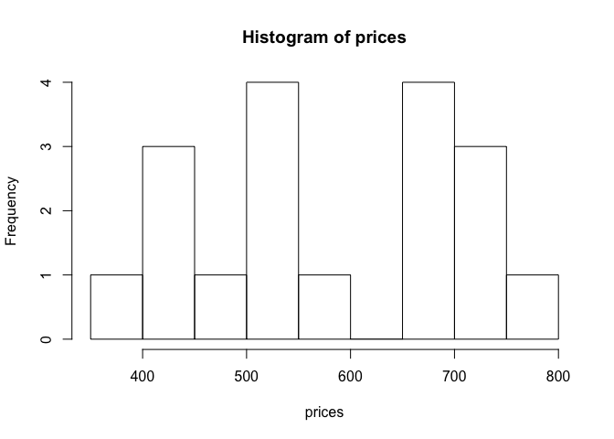
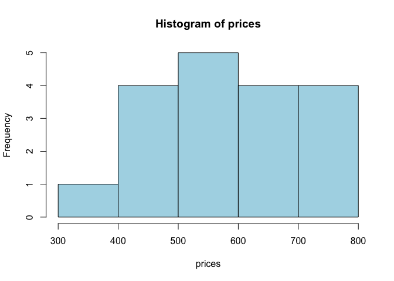
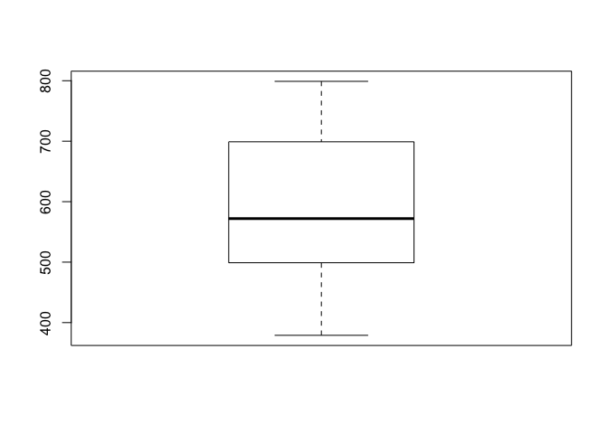

-   [Stem and leaf plot (1.2)](#stem-and-leaf-plot-1.2)
-   [Frequency histogram (1.2)](#frequency-histogram-1.2)
-   [Density histogram (1.2)](#density-histogram-1.2)
-   [Measures of location (1.3)](#measures-of-location-1.3)
-   [Measures of variability (1.4)](#measures-of-variability-1.4)
-   [Boxplots (1.4)](#boxplots-1.4)

Stem and leaf plot (1.2)
------------------------

``` r
prices <- c(379, 425, 450, 450, 499, 529, 535, 535, 545, 599, 665,
            675, 699, 699, 725, 725, 745, 799)

stem(prices)
```

    ## 
    ##   The decimal point is 2 digit(s) to the right of the |
    ## 
    ##   3 | 8
    ##   4 | 355
    ##   5 | 03445
    ##   6 | 078
    ##   7 | 00335
    ##   8 | 0

Frequency histogram (1.2)
-------------------------

``` r
prices <- c(379, 425, 450, 450, 499, 529, 535, 535, 545, 599, 665,
            675, 699, 699, 725, 725, 745, 799)

hist(prices)
```



``` r
hist(prices, breaks = c(300, 400, 500, 600, 700, 800),
     col = "lightblue")
```



Density histogram (1.2)
-----------------------

``` r
prices <- c(379, 425, 450, 450, 499, 529, 535, 535, 545, 599, 665,
            675, 699, 699, 725, 725, 745, 799)

hist(prices, freq = FALSE, 
     breaks = c(300, 400, 500, 600, 700, 800),
     col = "lightblue", las = 1)
```


Measures of location (1.3)
--------------------------

``` r
prices <- c(379, 425, 450, 450, 499, 529, 535, 535, 545, 599, 665,
            675, 699, 699, 725, 725, 745, 799)

mean(prices)
```

    ## [1] 593.2222

``` r
median(prices)
```

    ## [1] 572

``` r
# quartiles
quantile(prices)
```

    ##    0%   25%   50%   75%  100% 
    ## 379.0 506.5 572.0 699.0 799.0

``` r
# trimmed mean
mean(prices, trim = .1) # 10% trimmed mean
```

    ## [1] 593.75

Measures of variability (1.4)
-----------------------------

Sample variance

``` r
prices <- c(379, 425, 450, 450, 499, 529, 535, 535, 545, 599, 665,
            675, 699, 699, 725, 725, 745, 799)

var(prices)
```

    ## [1] 15981.48

Sample standard deviation

``` r
sqrt(var(prices))
```

    ## [1] 126.4179

``` r
sd(prices)
```

    ## [1] 126.4179

Five number summary

(min, lower-hinge, median, upper-hinge, max)

``` r
fivenum(prices)
```

    ## [1] 379 499 572 699 799

Boxplots (1.4)
--------------

``` r
prices <- c(379, 425, 450, 450, 499, 529, 535, 535, 545,
            599, 665, 675, 699, 699, 725, 725, 745, 799)

boxplot(prices)
```



``` r
boxplot(prices, horizontal = TRUE)
```


``` r
PTSD <- c(10, 20, 25, 28, 31, 35, 37, 38, 38, 39, 39, 42, 46)

Healthy <- c(23, 39, 40, 41, 43, 47, 51, 58, 63, 66, 67, 69, 72)

df <- data.frame(Healthy, PTSD)

boxplot(df, horizontal = TRUE)
```


