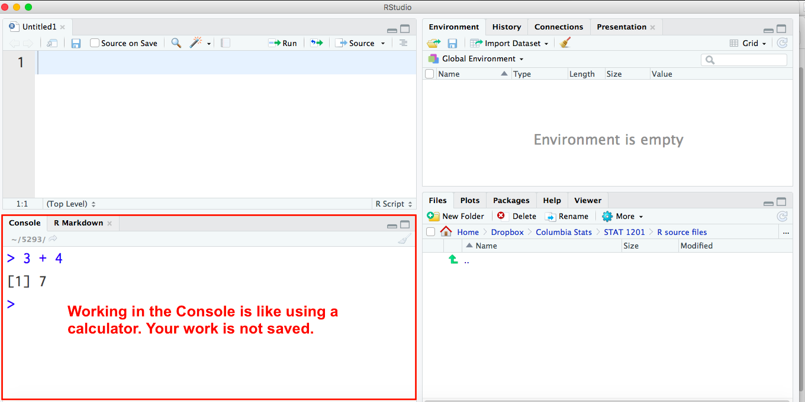
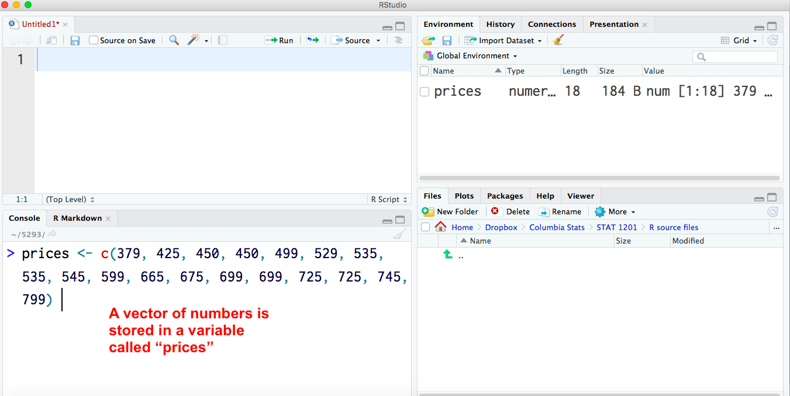
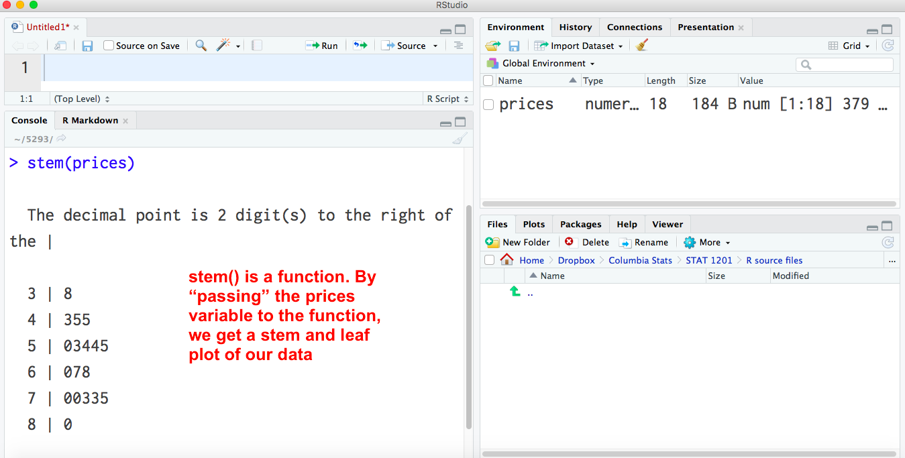
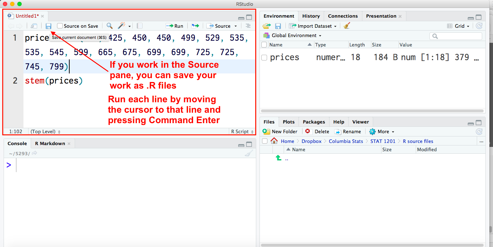
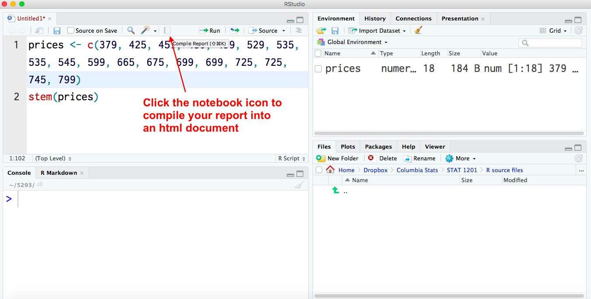
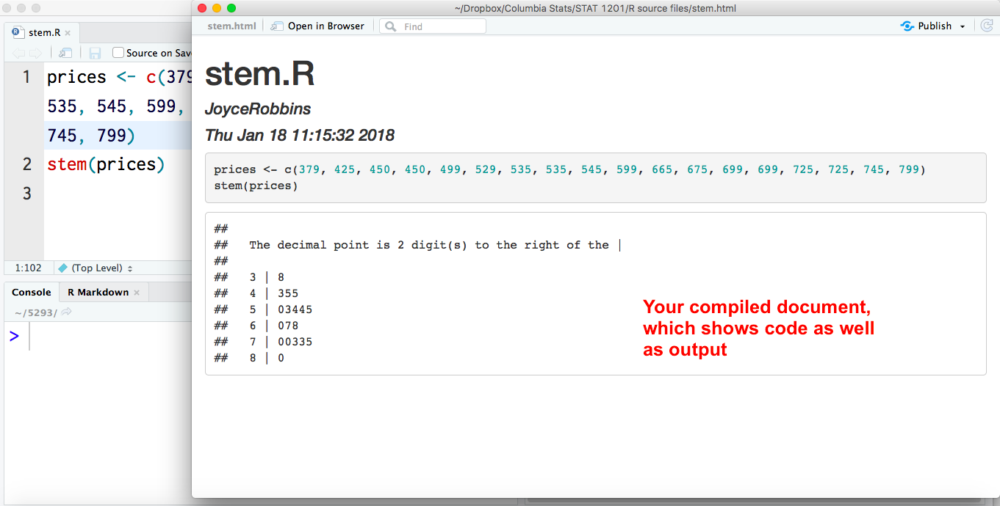
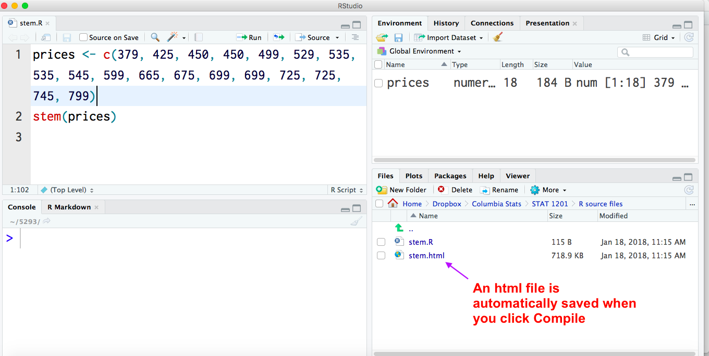

# Getting Started with R {-}

```{r, echo = FALSE}
knitr::opts_chunk$set(out.width = '65%', fig.align = 'center')
```


## Using R without installing it {-}

[https://rdrr.io/snippets/](https://rdrr.io/snippets/){target="_blank"}

The bare minimum:

You can create vectors of numbers using this format:

```{r}
x <- c(10, 12, 15, 20, 21, 22, 35, 45, 50)      # click to copy --> 
```

Then you can use R functions to find numerical and graphical summaries of the vectors (collections of numbers):

```{r, out.width='65%', fig.align='center'}
mean(x)
median(x)
sd(x)
fivenum(x)
stem(x)
hist(x)
boxplot(x)
```


 
## Installing R {-}

You will need to install two applications: R and RStudio:

* R -- the programming language itself -- is available here:

https://cran.r-project.org


* RStudio -- an integrated development environment (IDE) which makes it much easier to use R. It is optional but highly recommended. This is the app you will open to use R. Choose the free version of RStudio Desktop:

https://www.rstudio.com/products/rstudio/download/#download


## Getting Started with R: Working in the Console {-}

The first step in getting started is getting comfortable working in the RStudio console. It works like a calculator in the sense that your work is not saved. Do the following:

### Watch the video {-}

<iframe width="560" height="315" src="https://www.youtube.com/embed/tQvtYdLvSSg" frameborder="0" allow="accelerometer; autoplay; encrypted-media; gyroscope; picture-in-picture" allowfullscreen></iframe>


### Quick review of material covered in the video, plus additional examples {-}

Working in the console pane is similar to a using a calculator: each line of code is executed when you press enter. Note that your work is not saved with this approach.


[{width="100%" height="100%"}]()


Assigning a variable

[{width="100%" height="100%"}]()

Drawing a stem and leaf plot

[{width="100%" height="100%"}]()


Basic operations:
```{r}
3 + 4
3 - 4
3 * 4
3 / 4
3^4
sqrt(3)
```

Working with vectors:

```{r}
x <- 1:5
x
x + 10
x^2
sum(x)
```

### Additional resources {-}

See the examples in [Chapter 1 of Introduction to R](https://monashdatafluency.github.io/r-intro-2/starting-out-in-r.html){target="_blank"}


## Creating Graphs, Saving your work {-}

**Video**

<iframe width="560" height="315" src="https://www.youtube.com/embed/TbQiuKuNdg8" frameborder="0" allow="accelerometer; autoplay; clipboard-write; encrypted-media; gyroscope; picture-in-picture" allowfullscreen></iframe>

### Saving code as an .R file  {-}

(Also covered in video above)

[{width="100%" height="100%"}]()

Saving with this method saves only the code, not the output. Below are two methods for creating .html documents that contain both code and output:

### Convert .R file to .html {-}

(Also covered in video above)

[{width="100%" height="100%"}]()

[{width="100%" height="100%"}]()

[{width="100%" height="100%"}]()

[{width="100%" height="100%"}]()

### Reading files  {-}

The easiest way to read in the data for the textbook exercises is to read it directly from the following URL as follows:

```{r}
data <- read.csv("https://raw.githubusercontent.com/jtr13/1201/main/Devore9e_Final_Datasets/CSV/CH01/ex01-63.csv")
```

(Full URL: `https://raw.githubusercontent.com/jtr13/1201/main/Devore9e_Final_Datasets/CSV/CH01/ex01-63.csv`)

Note that `data` is a data frame:

```{r}
head(data)
```

To convert it to a vector use:

```{r}
noise <- data$noise
```

Now you can use the same functions as described above:

```{r, out.width='65%', fig.align='center'}
boxplot(noise, horizontal = TRUE)
```
